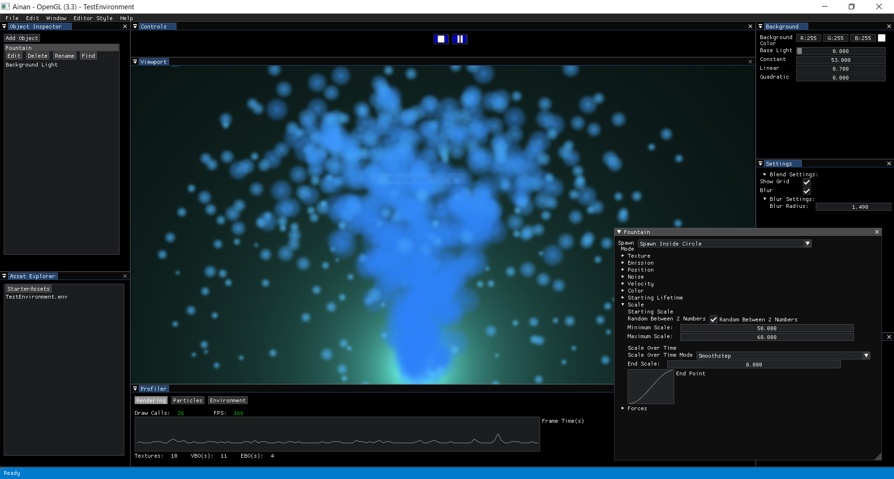

# ALZparticles
ALZparticles is an app developed in OpenGL and c++ to make cool graphics easily through particle systems.

At the moment it only runs on windows.

There are plans for linux and mac support (that is why I'm looking for contributers with linux/mac see contribute)

# Building the Project
The project is built using Premake5 (see [Premake](https://github.com/premake/premake-core)). I only tested it on windows (tested on MSVC2017) as of now.

Steps on building in windows:

1. Open commandline window on project directory.
2. Type "premake5 vsYOUR_VISUAL_STUDIO_VERSION", so for me it was "premake5 vs2017".
3. Open the newly generated Buid directory and open Simple-Bezier-Curve-OpenGL.sln.
4. Build and run the executable in VisualStudio

Similar steps can be made to build for systems other than windows but I do not guarantee they will work for now. 

# Documentation
Still to be made, I'm planning to slowly build it through time. It will be available through the wiki page of this repository.

# Examples

# Contribute
Every contribution is welcome even if it is not planned but we will have a discussion about it to see if it fits the project or you can chose something from the To Do list [here](https://github.com/AbdullrahmanAlzeidi/ALZparticles/projects) and work on it (you don't havet to notify me however it would be prefered so we don't have more than 1 guy working on something).

Issues are more than welcome aswell.

# Libraries used
* GLFW
* Dear ImGui
* glad
* stb image
* GLM
* Premake5
* nlohmann/json
